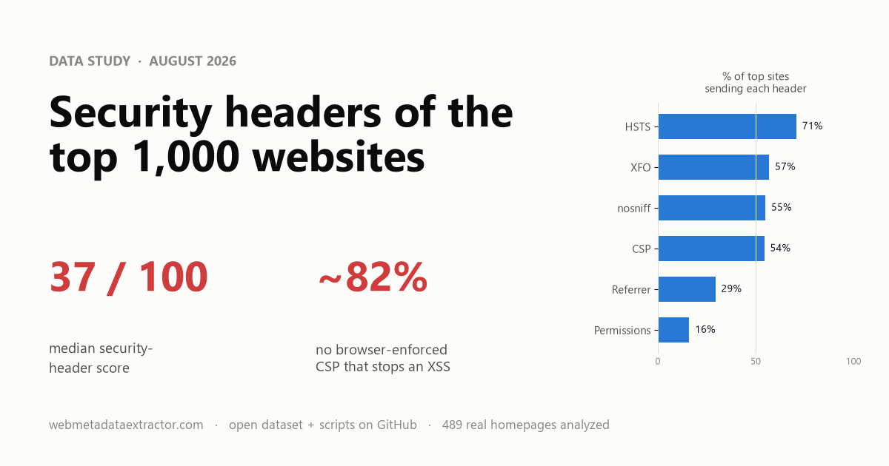
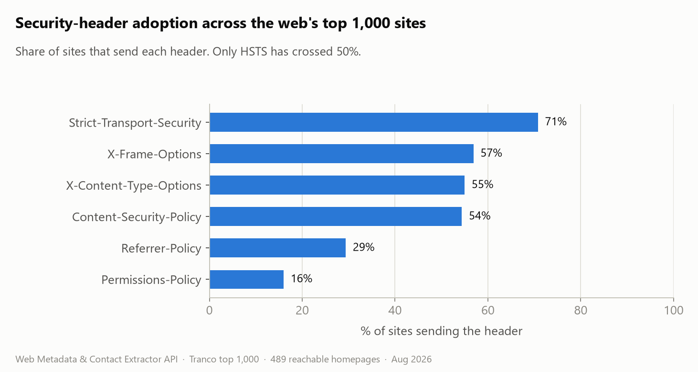
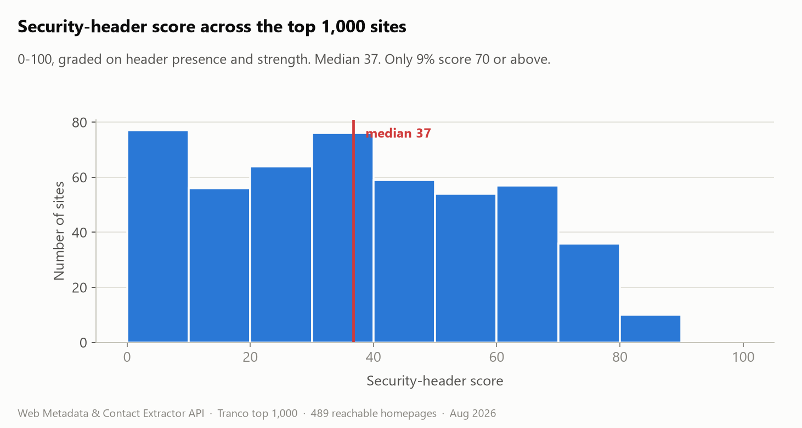
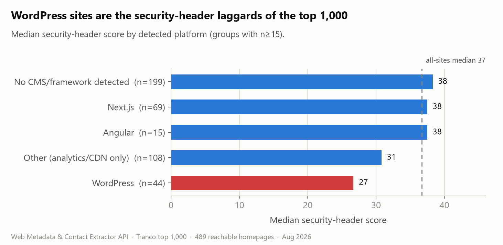
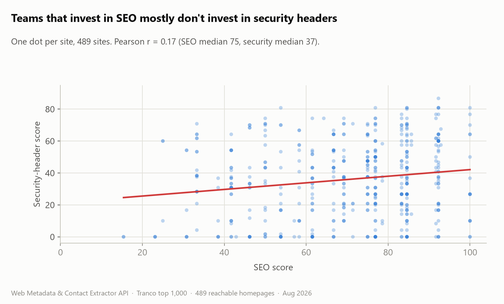

# Security headers of the top 1,000 websites



A snapshot of how the world's most visited sites configure their HTTP security
headers, taken in August 2026. Every homepage in the [Tranco](https://tranco-list.eu/)
top 1,000 was fetched once and graded on six response headers plus a detected
tech stack.

**Headline: the median security-header score is 37 / 100. Fewer than 1 in 10 of
the top sites score 70 or above, and 13% send no security headers at all.**

**[Interactive version -> https://josejux.github.io/top-1000-security-headers/](https://josejux.github.io/top-1000-security-headers/)** (charts with hover, and a
searchable table of all 1,000 domains).

The full per-site dataset is in [`data/top1000-web-report.csv`](data/top1000-web-report.csv)
(MIT licensed). The scan and analysis scripts are in this repo and reproduce the
numbers below from scratch. Figures below are over the **489 real, reachable
homepages** in the top 1,000 (see Coverage).

---

## What was measured

For each domain, one GET request to `https://<domain>` (following redirects),
then six headers graded `missing` / `weak` / `reasonable` / `strong`:

| Header | What it does |
|---|---|
| `Strict-Transport-Security` | Forces HTTPS on later visits, closes the first-request downgrade window |
| `Content-Security-Policy` | Main browser-side defense against XSS |
| `X-Frame-Options` | Anti-clickjacking (one line) |
| `X-Content-Type-Options` | Stops MIME sniffing (one line: `nosniff`) |
| `Referrer-Policy` | Limits URL leakage to third parties |
| `Permissions-Policy` | Disables unused browser features (camera, geolocation, ...) |

The score is the average of the six grades (missing = 0, weak = 0.25,
reasonable = 0.6, strong = 1.0), as a percentage. A `Content-Security-Policy`
that contains `unsafe-inline`, `unsafe-eval` or a wildcard source is graded
`weak`, not `strong` - it exists but provides little real protection.

The tech stack (WordPress, Next.js, ...) is detected from HTML and header
signatures by the same API.

## Coverage

| | Count | |
|---|---:|---|
| Domains in the Tranco top 1,000 | 1,000 | |
| Not a website (DNS-only infra, CDNs, non-HTML) | 225 | excluded |
| Unreachable (timeout, geo-block, paywall, apex quirk) | 209 | excluded |
| Served a bot-challenge / WAF page instead of the site | 43 | excluded |
| Degraded / placeholder page | 34 | excluded |
| **Real homepages analyzed** | **489** | all figures below use this set |

The ~286 real sites we could not read skew toward the heavily bot-protected, so
if anything the true picture is slightly *worse* than what follows: the sites
that block automated inspection are, on average, the ones that also invest in
headers.

---

## Findings

### 1. Most of the top sites are missing most of the headers



Only `Strict-Transport-Security` (71%) is on a majority of sites. Two one-line
headers that cost nothing to add - `X-Frame-Options` and `X-Content-Type-Options`
- are missing on ~45% of the top 1,000. `Permissions-Policy` is on 16%.

### 2. The score distribution is bottom-heavy



Median 37, mean 36. A quarter of sites score 17 or below. Only 9% clear 70.

Content-Security-Policy is the clearest failure: 46% of sites have none, and of
the 54% that do, all but 90 sites carry `unsafe-inline` or a wildcard. **About
82% of the top 1,000 have no browser-enforced CSP worth the name** - only 3 sites
in the whole set have one I would call strong.

### 3. The tech stack predicts the posture



WordPress sites (n=44) sit ~10 points below the field: median 27, and 61% ship
no CSP versus 46% overall. Sites on Next.js and other framework/edge stacks land
around the median or just above, mostly carried by better default HSTS from
their hosting (Vercel, Netlify, Cloudflare Pages). Astro (n=8, too small to lean
on) and Drupal (n=10) were the only groups with a median above 42.

The same split shows up *within* WordPress: those 44 sites have a median SEO
score of 83, well above the overall 75. They do SEO well and headers badly.

### 4. SEO effort and security effort are almost unrelated



Pearson r = 0.17. The top sites have largely solved SEO (median score 75) and
largely ignored security headers (median 37). The teams tuning one are mostly
not the teams hardening the other.

### 5. Server software, briefly

Cloudflare (90 sites) and nginx (87) dominate the `Server` header among the 380
sites that send one. Version disclosure is rare and mostly harmless: 7% of
`Server` values include a version number, and 12% of sites send `X-Powered-By`
(most often a benign `Next.js`, a few leaking a PHP or KPHP version).

---

## Reproduce it

```bash
pip install httpx matplotlib
# 1. get the domain list
curl -sL -o tranco.zip https://tranco-list.eu/top-1m.csv.zip
# 2. run a local instance of the extractor API on :8899 (see the API repo), then:
python scan.py 1000      # -> results.jsonl   (~3 min)
python analyze.py        # -> summary.json + data/top1000-web-report.csv
python make_charts.py    # -> charts/*.png
python make_card.py      # -> docs/social-card.png
python build_site.py     # -> docs/data.js  (rebuilds the interactive page)
```

The grading was done by the open-source **Web Metadata & Contact Extractor API**
([repo](https://github.com/JosejuX/rapidapi-metadata-extractor)) via its
`/api/v1/extract` endpoint. You can point `scan.py` at the hosted version or run
your own; either way one call returns the header grades, the security score, the
SEO score and the detected tech stack for a URL.

## Files

| Path | |
|---|---|
| [`data/top1000-web-report.csv`](data/top1000-web-report.csv) | one row per domain: scores, grades, platform, server |
| [`data/results.jsonl.gz`](data/results.jsonl.gz) | raw API responses, one JSON object per line |
| `scan.py` / `analyze.py` / `make_charts.py` / `make_card.py` / `build_site.py` | the pipeline |
| `docs/` | the interactive page (static HTML/CSS/JS, deploys as-is) |
| `summary.json` | every aggregate used above |

## License

MIT for the code and the dataset. The domain list is from Tranco and carries its
own terms.
